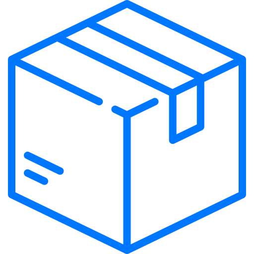

<div align="center">




<h1>Loja Ponto Com</h1>

</div>


<div align="center">


</div>

---

## Sobre o Projeto

**Loja Ponto Com** é uma plataforma de e-commerce desenvolvida como projeto prático da disciplina de Desenvolvimento Web 1 do IFSP. O sistema permite que usuários comprem produtos de diversos fornecedores, além de possibilitar que os próprios usuários se cadastrem como vendedores para oferecer seus produtos na plataforma.

### Objetivo

Criar uma solução de marketplace que:
- Facilite a compra e venda de produtos online
- Ofereça uma experiência de compra completa, desde a navegação até o pagamento
- Gerencie todo o ciclo de vida de um pedido

---

## Funcionalidades

### Para Clientes

-  **Cadastro e Login**: Sistema completo de autenticação de usuários
-  **Catálogo de Produtos**: Navegação por categorias e visualização detalhada
-  **Busca e Filtros**: Sistema de busca inteligente por nome de produtos
-  **Carrinho de Compras**: Adicionar, remover e alterar quantidades de produtos
-  **Gestão de Endereços**: Cadastrar, editar e excluir endereços de entrega
-  **Finalização de Pedido**: Processo completo de checkout
-  **Múltiplas Formas de Pagamento**: Cartão de Crédito, PIX e Boleto
-  **Histórico de Compras**: Visualização de todos os pedidos realizados
-  **Avaliações e Comentários**: Avaliar produtos comprados
-  **Perfil do Usuário**: Atualização de dados pessoais

### Para Fornecedores

-  **Gestão de Produtos**: Cadastrar, editar e excluir produtos
-  **Upload de Múltiplas Imagens**: Até 5 imagens por produto
-  **Sistema de Rascunhos**: Salvar produtos incompletos para finalizar depois
-  **Categorização**: Organizar produtos por categorias
-  **Especificações Técnicas**: Adicionar características e detalhes dos produtos
-  **Controle de Estoque**: Gerenciar quantidade disponível
-  **Visualização de Vendas**: Acompanhar produtos vendidos

### Funcionalidades Técnicas

-  **Sessões Persistentes**: Manutenção de estado do usuário
-  **Segurança**: Proteção contra SQL Injection e XSS
-  **Validação de Dados**: Frontend e Backend
-  **Responsividade**: Design adaptável para mobile, tablet e desktop
-  **Performance**: Otimização de consultas ao banco de dados

---

## Tecnologias Utilizadas

### Frontend
- **HTML5**: Estruturação semântica das páginas
- **CSS3**: Estilização vanilla (sem frameworks)
- **JavaScript (ES6+)**: Interatividade e validações do lado do cliente
- **Ajax/Fetch API**: Requisições assíncronas

### Backend
- **PHP (Vanilla)**: Lógica de negócio e processamento de dados
- **PDO (PHP Data Objects)**: Abstração de banco de dados com Prepared Statements

### Banco de Dados
- **MySQL**: Sistema de gerenciamento de banco de dados relacional
- **Modelo Normalizado**: Estrutura otimizada com relacionamentos adequados

### Segurança
- **Prepared Statements**: Prevenção de SQL Injection
- **htmlspecialchars()**: Prevenção de XSS (Cross-Site Scripting)
- **Password Hashing**: Senhas criptografadas
- **Validação de Sessão**: Controle de acesso às páginas

### Ferramentas de Desenvolvimento
- **XAMPP/WAMP**: Ambiente de desenvolvimento local
- **Git**: Controle de versão
- **VSCode**: Editor de código
- **Cypress**: Testes E2E automatizados

---

## Estrutura do Projeto

Para ver a organização detalhada dos arquivos e diretórios, consulte a **[estrutura do projeto](docs/STRUCTURE.md)**.

---

## Como Instalar e Rodar o Projeto

### Pré-requisitos

- **PHP 8.0+** ou superior
- **MySQL 5.7+** ou superior
- **Servidor Web** (Apache ou Nginx)
- **XAMPP** ou **WAMP** (recomendado para ambiente local)

### Passo a Passo

#### 1. Clone o Repositório

```bash
git clone https://github.com/mar-moraes/Loja-Ponto-Com.git
cd Loja-Ponto-Com
```

#### 2. Configure o Banco de Dados

##### 2.1. Crie o Banco de Dados

Abra o **phpMyAdmin** (geralmente em `http://localhost/phpmyadmin`) ou seu cliente MySQL preferido.

##### 2.2. Importe o SQL

Importe o arquivo de dump do banco de dados:

```bash
mysql -u seu_usuario -p < "Banco de dados/bancodadosteste.sql"
```

Ou pelo phpMyAdmin:
1. Clique em "Importar"
2. Selecione o arquivo `Banco de dados/bancodadosteste.sql`
3. Clique em "Executar"

#### 3. Configure as Credenciais do Banco

Edite o arquivo `Banco de dados/conexao.php` e ajuste as credenciais:

```php
<?php
$dsn = 'mysql:host=127.0.0.1;dbname=bancodadosteste';
$dbusername = '';
$dbpassword = '';
?>
```

#### 4. Configure o Servidor Web

##### Usando XAMPP/WAMP:

1. Copie a pasta do projeto para `htdocs/` (XAMPP) ou `www/` (WAMP)
2. Inicie o Apache e MySQL pelo painel de controle
3. Acesse: `http://localhost:3000/src/index.php`

##### Usando o Servidor Embutido do PHP:

```bash
php -S localhost:3000
```

Acesse: http://localhost:3000/src/index.php

#### 5. Acesse o Sistema

- **Página Inicial**: `http://localhost:3000/src/index.php`
- **Login**: `http://localhost:3000/src/tela_login.html`
- **Cadastro**: `http://localhost:3000/src/tela_cadastro.html`

---

## Configuração de Variáveis de Ambiente

O projeto utiliza arquivo de configuração direto em PHP. Edite o arquivo `Banco de dados/conexao.php`:

```php
<?php
// Configurações do Banco de Dados
$host = 'localhost';              // Host do MySQL
$dbname = 'bancodadosteste';       // Nome do banco de dados
$username = 'root';               // Usuário do MySQL
$password = '';                   // Senha do MySQL
$charset = 'utf8mb4';             // Charset

// DSN para conexão PDO
$dsn = "mysql:host=$host;dbname=$dbname;charset=$charset";

// Opções do PDO
$options = [
    PDO::ATTR_ERRMODE            => PDO::ERRMODE_EXCEPTION,
    PDO::ATTR_DEFAULT_FETCH_MODE => PDO::FETCH_ASSOC,
    PDO::ATTR_EMULATE_PREPARES   => false,
];

try {
    $pdo = new PDO($dsn, $username, $password, $options);
} catch (\PDOException $e) {
    throw new \PDOException($e->getMessage(), (int)$e->getCode());
}
?>
```

### Configurações Importantes:

| Variável | Descrição | Valor Padrão |
|----------|-----------|--------------|
| `$host` | Endereço do servidor MySQL | `localhost` |
| `$dbname` | Nome do banco de dados | `bancodadosteste` |
| `$username` | Usuário do banco de dados | `root` |
| `$password` | Senha do banco de dados | _(vazio)_ |

---

## Como Contribuir


Para detalhes sobre como colaborar com este projeto, leia o **[Guia de Contribuição](CONTRIBUTING.md)**.

---

## Capturas de Tela

### Página Inicial


---

### Detalhes do Produto


---

### Carrinho de Compras


---

### Checkout - Entrega


---

### Checkout - Pagamento


---

### Minha Conta


---

### Painel do Fornecedor


---

## Arquitetura e Diagramas

Para uma visão detalhada da estrutura técnica do projeto e seus diagramas UML, consulte a **[documentação de arquitetura](docs/ARCHITECTURE.md)**.

---

## Testes

O projeto conta com testes E2E automatizados usando Cypress.

### Rodando os Testes

```bash
# Instalar dependências
npm install

# Abrir Cypress (modo interativo)
npx cypress open

# Executar testes (modo headless)
npx cypress run
```

### Cobertura de Testes

- [x] Fluxo de cadastro de usuário
- [x] Fluxo de login
- [x] Navegação no catálogo
- [x] Adicionar produtos ao carrinho
- [x] Processo de checkout completo
- [x] Cadastro de produtos (fornecedor)
- [x] Sistema de rascunhos

---

## Documentação Adicional

Para mais informações sobre o projeto, consulte:

- **[Diretrizes do Trabalho Prático](Artefatos/Diretrizes_TrabalhoPrático.pdf)**: Escopo e regras do projeto
- **[Telas e Requisitos](Artefatos/Telas%20e%20requisitos.pdf)**: Detalhamento funcional
- **[Apresentação do Projeto](Artefatos/Slides/slides.pdf)**: Slides da apresentação

---

## Roadmap e Melhorias

Confira nosso **[Roadmap](ROADMAP.md)** para ver as próximas funcionalidades planejadas e melhorias técnicas.

---

## Autores

<table width="100%">
  <tr>
    <td align="left" width="33%">
      <a href="https://github.com/mar-moraes">
        
      </a>
    </td>
    <td align="center" width="33%">
      <a href="https://github.com/Vanamaral">
        
      </a>
    </td>
    <td align="right" width="33%">
      <a href="https://github.com/Igaust-5767">
        
      </a>
    </td>
  </tr>
</table>


---


## Suporte

Encontrou algum problema ou tem alguma sugestão? Abra uma [issue](https://github.com/mar-moraes/Loja-Ponto-Com/issues) no GitHub.

---

